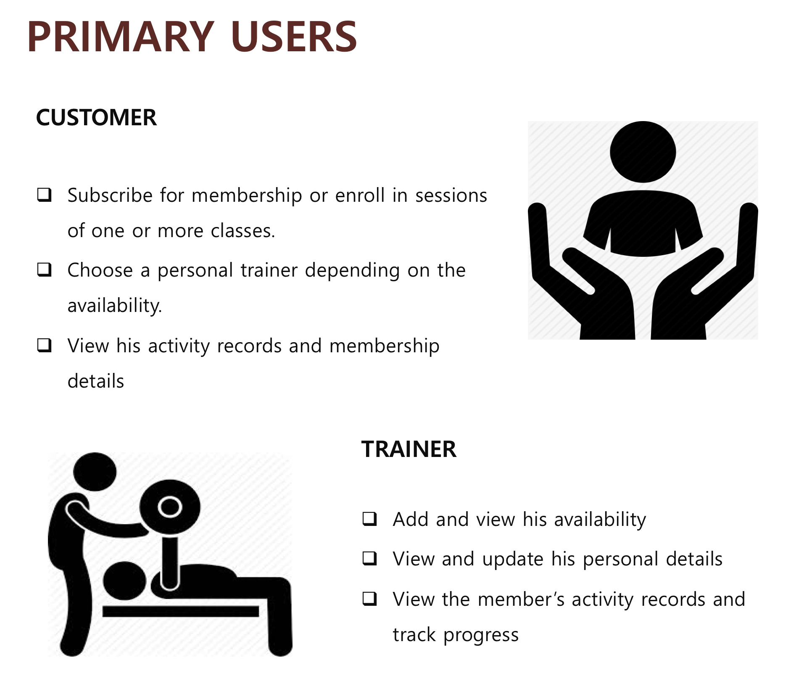
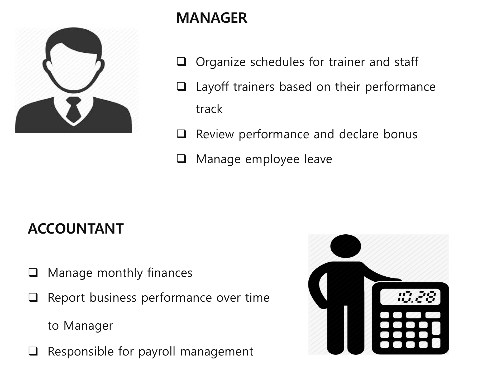
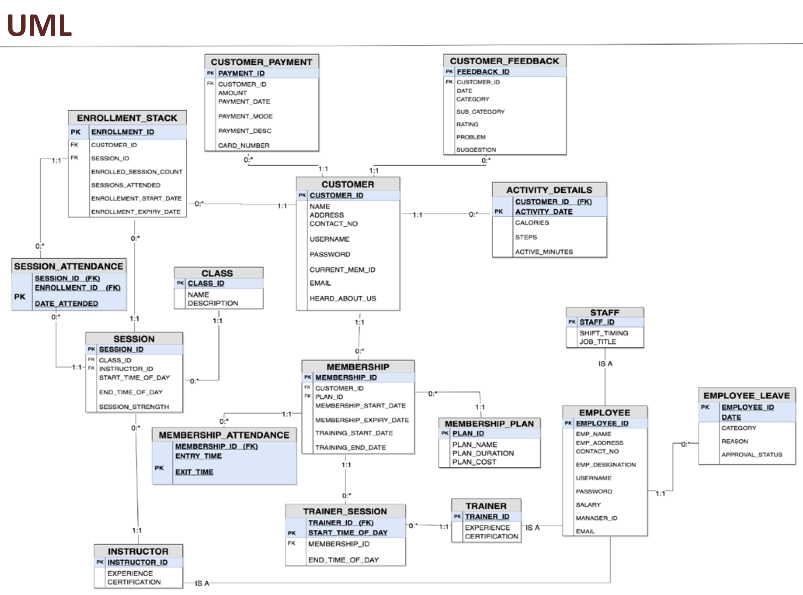
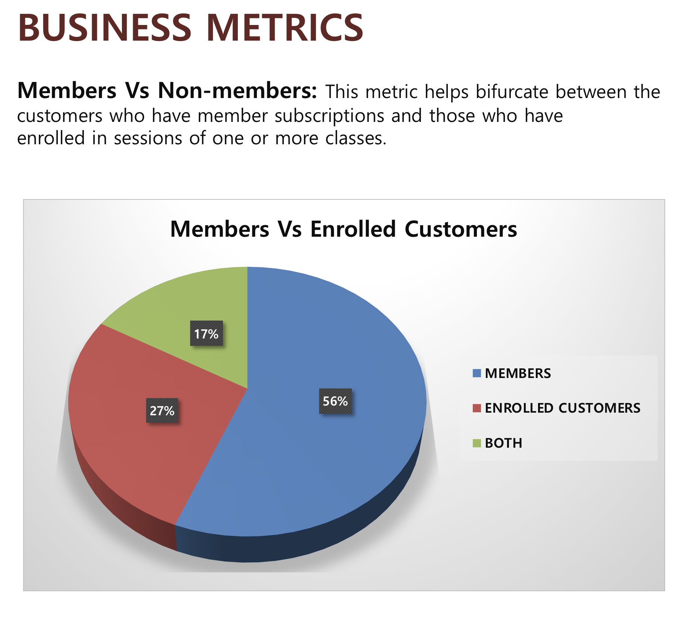
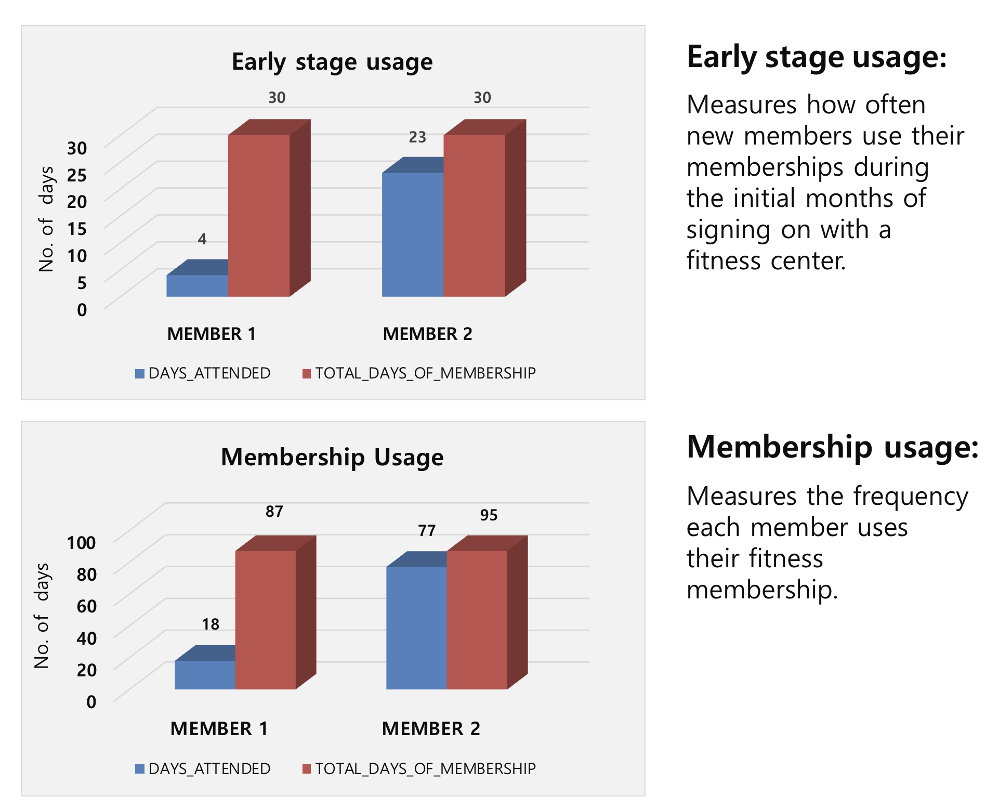
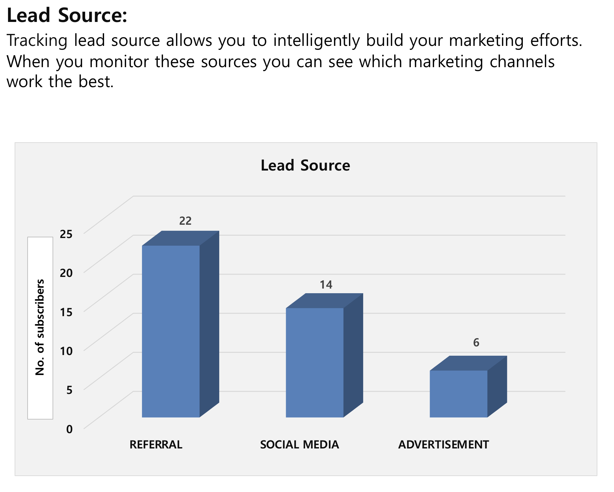
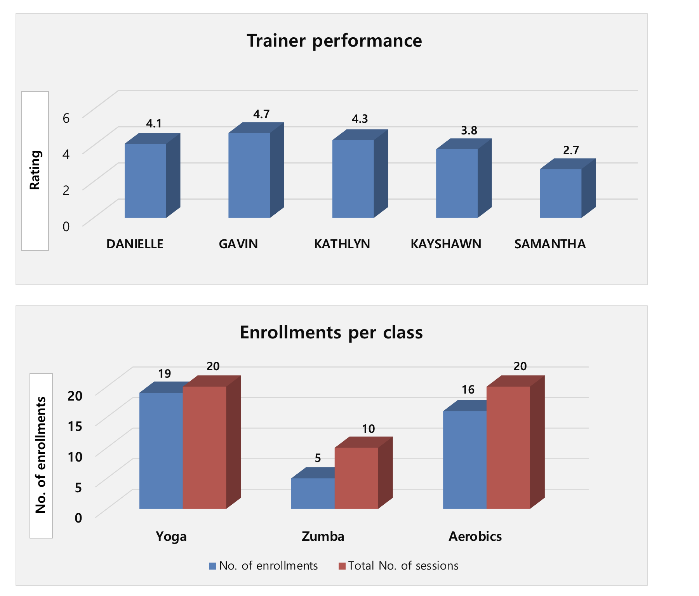
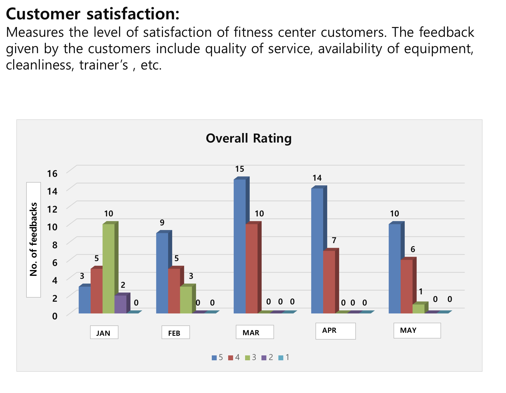

# Database-Management-System
Provides oversight and management of day-to-day operations of a 
fitness facility, streamlining several backend duties that drain time and 
resources, thus making the management staff focus on their members.

### Key functionalities include:
- Providing qualified trainers and supervising their performance. 
- Customer payment management
- Analyzing and interpreting trends for marketing purpose
- Activity tracking of customers and assessment of their fitness level
- Providing various classes based on participation and interest
- Assessment of the fitness centre based on customer feedback

